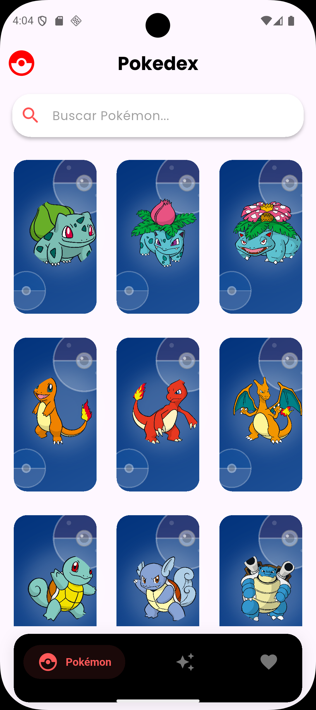
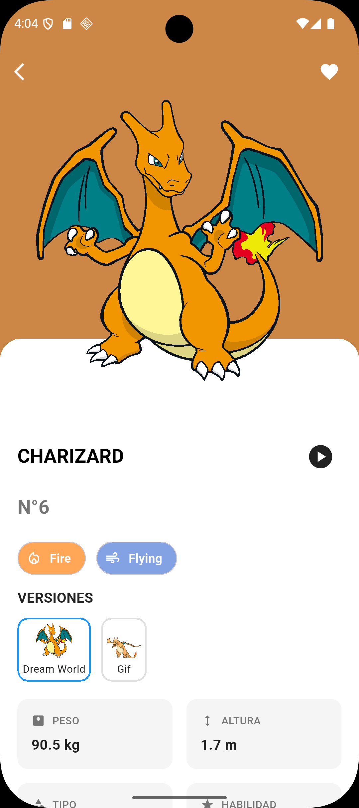
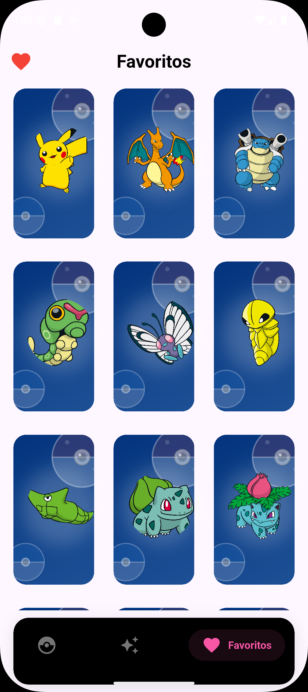

  

 

---
# Pokémon App 🎮  

Aplicación desarrollada en **Flutter** que consume la [PokeAPI](https://pokeapi.co/) para mostrar información de Pokémon en tiempo real.  

---

## ✨ Características
- 📋 Listado de Pokémon con paginación infinita.  
- 🔎 Búsqueda de Pokémon por nombre o ID.  
- 📊 Vista detallada de cada Pokémon:
  - Nombre, ID y tipos.  
  - Estadísticas base (HP, Ataque, Defensa, etc.).  
  - Habilidades y movimientos.  
  - Sprites oficiales.  
- ⭐ Gestión de favoritos.  
- 🎨 Interfaz amigable, responsiva y moderna.  

---

## 🛠️ Tecnologías utilizadas
- [Flutter](https://flutter.dev/)  
- [Dart](https://dart.dev/)  
- [PokeAPI](https://pokeapi.co/)  

---

## Screenshots

    

## License

[MIT](https://choosealicense.com/licenses/mit/)

